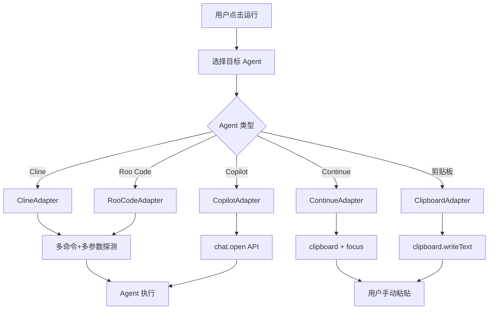
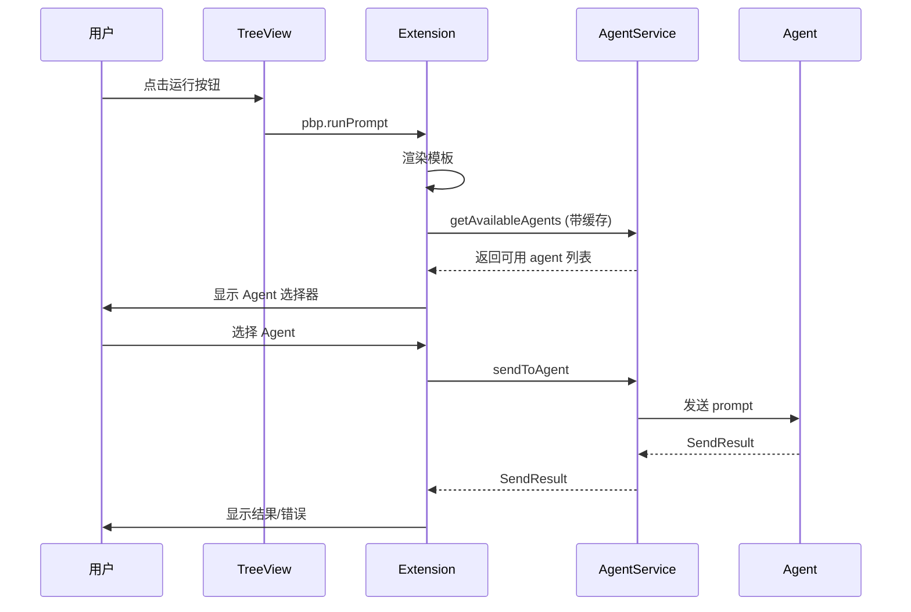

# Agent 集成设计方案 (v3)

## 背景

当前 `llmAdapter.ts` 直接调用 LLM API（Ollama、OpenAI、Claude 等），但这不符合产品目标。正确的做法是将渲染后的 prompt 发送到用户选择的 VS Code agent 插件执行。

## 目标 Agent 插件

| Agent | Extension ID | 优先级 |
|---|---|---|
| **Cline** | `saoudrizwan.claude-dev` | ⭐⭐⭐⭐ |
| **Roo Code** | `RooVeterinaryInc.roo-cline` | ⭐⭐⭐⭐ |
| **GitHub Copilot Chat** | `GitHub.copilot-chat` | ⭐⭐⭐⭐⭐ |
| **Continue** | `continue.continue` | ⭐⭐⭐ |
| **Clipboard** | N/A (内置) | ⭐⭐ (兜底) |

> ⚠️ **注意**：Extension ID 大小写必须与 VS Code Marketplace 完全一致！

## 集成方式分析

### 1. Cline 集成

**命令探测策略**（多候选命令 + 多参数格式 + 动态探测）：
```typescript
// Cline 可能的命令和参数格式
private static readonly CANDIDATE_INVOCATIONS = [
  { cmd: 'cline.newTask', args: (p: string) => [p] },
  { cmd: 'cline.newTask', args: (p: string) => [{ task: p }] },
  { cmd: 'claude-dev.newTask', args: (p: string) => [p] },
  { cmd: 'claude-dev.newTask', args: (p: string) => [{ task: p }] },
  { cmd: 'cline.openNewTask', args: (p: string) => [p] },
];

async sendPrompt(prompt: string): Promise<SendResult> {
  for (const { cmd, args } of ClineAdapter.CANDIDATE_INVOCATIONS) {
    try {
      await vscode.commands.executeCommand(cmd, ...args(prompt));
      return { success: true };
    } catch {
      continue;
    }
  }
  return this.fallbackToClipboard(prompt);
}
```

### 2. Roo Code 集成

与 Cline 类似，命令候选：
```typescript
private static readonly CANDIDATE_INVOCATIONS = [
  { cmd: 'roo-cline.newTask', args: (p: string) => [p] },
  { cmd: 'roo-cline.newTask', args: (p: string) => [{ task: p }] },
  { cmd: 'rooveterinaryinc.roo-cline.newTask', args: (p: string) => [p] },
];
```

### 3. GitHub Copilot Chat 集成

**正确的 API 调用**：
```typescript
async sendPrompt(prompt: string, options?: SendOptions): Promise<SendResult> {
  // 默认 autoSubmit=true，即直接提交
  const autoSubmit = options?.autoSubmit ?? true;
  
  try {
    // VSCode >= 1.95 支持 isPartialQuery 参数
    await vscode.commands.executeCommand('workbench.action.chat.open', {
      query: prompt,
      isPartialQuery: !autoSubmit,
    });
    return { success: true };
  } catch (error) {
    return { success: false, reason: 'command_failed', message: String(error) };
  }
}
```

**注意**：
- `workbench.action.chat.submit` 不是有效命令！
- 使用 `workbench.action.chat.open` + `query` 参数
- Extension ID 是 `GitHub.copilot-chat`，不是 `GitHub.copilot`

### 4. Continue 集成

**保守实现**（复制到剪贴板 + focus 面板）：
```typescript
async sendPrompt(prompt: string): Promise<SendResult> {
  // Continue 的命令 API 不稳定，使用保守方案
  await vscode.env.clipboard.writeText(prompt);
  
  try {
    // 尝试 focus Continue 面板
    await vscode.commands.executeCommand('continue.focusContinueInput');
  } catch {
    // 如果命令不存在，用户需要手动打开 Continue
  }
  
  vscode.window.showInformationMessage(
    'Prompt copied! Press Ctrl+V to paste in Continue.'
  );
  return { success: true };
}
```

### 5. Clipboard (通用回退)

```typescript
async sendPrompt(prompt: string): Promise<SendResult> {
  await vscode.env.clipboard.writeText(prompt);
  vscode.window.showInformationMessage('Prompt copied to clipboard!');
  return { success: true };
}
```

## 推荐架构



## 模块设计

### 1. 类型定义

```typescript
// src/types/agent.ts
export type AgentType = 'cline' | 'roo-code' | 'copilot' | 'continue' | 'clipboard';

export type SendResult =
  | { success: true }
  | { success: false; reason: 'unavailable' | 'command_failed' | 'timeout'; message: string };

export interface AgentCapabilities {
  canSendDirectly: boolean;      // 是否支持直接发送
  canOpenPanel: boolean;         // 是否能打开侧边栏
  requiresConfirmation: boolean; // 是否需要用户手动确认
}

export interface SendOptions {
  openPanel?: boolean;    // 是否打开 Agent 面板
  autoSubmit?: boolean;   // 是否自动提交（默认 true）
}

export interface AgentAdapter {
  readonly name: string;
  readonly type: AgentType;
  readonly capabilities: AgentCapabilities;
  
  // 检查 agent 是否可用（包括扩展激活状态）
  isAvailable(): Promise<boolean>;
  
  // 发送 prompt 到 agent
  sendPrompt(prompt: string, options?: SendOptions): Promise<SendResult>;
  
  // 获取 agent 图标
  getIcon(): vscode.ThemeIcon;
}
```

### 2. AgentService 服务（含缓存）

```typescript
// src/services/agentService.ts
export class AgentService {
  private adapters: Map<AgentType, AgentAdapter>;
  private availabilityCache = new Map<AgentType, boolean>();
  private cacheExpiry = 0;
  private readonly CACHE_TTL = 30_000; // 30秒
  
  constructor() {
    this.adapters = new Map([
      ['cline', new ClineAdapter()],
      ['roo-code', new RooCodeAdapter()],
      ['copilot', new CopilotAdapter()],
      ['continue', new ContinueAdapter()],
      ['clipboard', new ClipboardAdapter()],
    ]);
  }
  
  // 获取可用的 agents（带缓存）
  async getAvailableAgents(): Promise<AgentType[]> {
    const now = Date.now();
    if (now < this.cacheExpiry) {
      return [...this.availabilityCache.entries()]
        .filter(([, available]) => available)
        .map(([type]) => type);
    }

    // 并发检测所有 adapter
    const results = await Promise.allSettled(
      [...this.adapters.entries()].map(async ([type, adapter]) => {
        const available = await adapter.isAvailable();
        this.availabilityCache.set(type, available);
        return { type, available };
      })
    );

    this.cacheExpiry = now + this.CACHE_TTL;

    return results
      .filter((r): r is PromiseFulfilledResult<{ type: AgentType; available: boolean }> =>
        r.status === 'fulfilled' && r.value.available
      )
      .map(r => r.value.type);
  }
  
  // 发送 prompt 到指定 agent
  async sendToAgent(prompt: string, agent: AgentType): Promise<SendResult> {
    const adapter = this.adapters.get(agent);
    if (!adapter) {
      return { success: false, reason: 'unavailable', message: `Unknown agent: ${agent}` };
    }
    return adapter.sendPrompt(prompt);
  }
  
  // 手动刷新缓存（如扩展安装/卸载时）
  invalidateCache(): void {
    this.cacheExpiry = 0;
    this.availabilityCache.clear();
  }
  
  // 获取 adapter
  getAdapter(type: AgentType): AgentAdapter | undefined {
    return this.adapters.get(type);
  }
}
```

### 3. 适配器实现示例

#### ClineAdapter
```typescript
export class ClineAdapter implements AgentAdapter {
  readonly name = 'Cline';
  readonly type: AgentType = 'cline';
  readonly capabilities: AgentCapabilities = {
    canSendDirectly: true,
    canOpenPanel: true,
    requiresConfirmation: false,
  };
  
  private static readonly EXTENSION_ID = 'saoudrizwan.claude-dev';
  private static readonly CANDIDATE_INVOCATIONS = [
    { cmd: 'cline.newTask', args: (p: string) => [p] },
    { cmd: 'cline.newTask', args: (p: string) => [{ task: p }] },
    { cmd: 'claude-dev.newTask', args: (p: string) => [p] },
    { cmd: 'claude-dev.newTask', args: (p: string) => [{ task: p }] },
  ];
  
  async isAvailable(): Promise<boolean> {
    const extension = vscode.extensions.getExtension(ClineAdapter.EXTENSION_ID);
    if (!extension) return false;
    
    if (!extension.isActive) {
      try {
        await extension.activate();
      } catch {
        return false;
      }
    }
    return true;
  }
  
  async sendPrompt(prompt: string, options?: SendOptions): Promise<SendResult> {
    for (const { cmd, args } of ClineAdapter.CANDIDATE_INVOCATIONS) {
      try {
        await vscode.commands.executeCommand(cmd, ...args(prompt));
        return { success: true };
      } catch {
        continue;
      }
    }
    return this.fallbackToClipboard(prompt);
  }
  
  private async fallbackToClipboard(prompt: string): Promise<SendResult> {
    await vscode.env.clipboard.writeText(prompt);
    vscode.window.showInformationMessage(
      'Could not send to Cline directly. Prompt copied to clipboard!'
    );
    return { success: true };
  }
  
  getIcon(): vscode.ThemeIcon {
    return new vscode.ThemeIcon('robot');
  }
}
```

#### CopilotAdapter
```typescript
export class CopilotAdapter implements AgentAdapter {
  readonly name = 'GitHub Copilot';
  readonly type: AgentType = 'copilot';
  readonly capabilities: AgentCapabilities = {
    canSendDirectly: true,
    canOpenPanel: true,
    requiresConfirmation: false,
  };
  
  // 注意：Chat 功能在 copilot-chat 扩展中
  private static readonly EXTENSION_ID = 'GitHub.copilot-chat';
  
  async isAvailable(): Promise<boolean> {
    const extension = vscode.extensions.getExtension(CopilotAdapter.EXTENSION_ID);
    if (!extension) return false;
    
    if (!extension.isActive) {
      try {
        await extension.activate();
      } catch {
        return false;
      }
    }
    return true;
  }
  
  async sendPrompt(prompt: string, options?: SendOptions): Promise<SendResult> {
    // 默认 autoSubmit=true
    const autoSubmit = options?.autoSubmit ?? true;
    
    try {
      await vscode.commands.executeCommand('workbench.action.chat.open', {
        query: prompt,
        isPartialQuery: !autoSubmit,
      });
      return { success: true };
    } catch (error) {
      return { 
        success: false, 
        reason: 'command_failed', 
        message: String(error) 
      };
    }
  }
  
  getIcon(): vscode.ThemeIcon {
    return new vscode.ThemeIcon('github');
  }
}
```

#### ContinueAdapter
```typescript
export class ContinueAdapter implements AgentAdapter {
  readonly name = 'Continue';
  readonly type: AgentType = 'continue';
  readonly capabilities: AgentCapabilities = {
    canSendDirectly: false,  // 不支持直接发送
    canOpenPanel: true,
    requiresConfirmation: true,  // 需要用户手动粘贴
  };
  
  private static readonly EXTENSION_ID = 'continue.continue';
  
  async isAvailable(): Promise<boolean> {
    const extension = vscode.extensions.getExtension(ContinueAdapter.EXTENSION_ID);
    if (!extension) return false;
    
    if (!extension.isActive) {
      try {
        await extension.activate();
      } catch {
        return false;
      }
    }
    return true;
  }
  
  async sendPrompt(prompt: string): Promise<SendResult> {
    // 保守实现：复制到剪贴板 + 尝试 focus
    await vscode.env.clipboard.writeText(prompt);
    
    try {
      await vscode.commands.executeCommand('continue.focusContinueInput');
    } catch {
      // 命令可能不存在，忽略
    }
    
    vscode.window.showInformationMessage(
      'Prompt copied! Press Ctrl+V to paste in Continue.'
    );
    return { success: true };
  }
  
  getIcon(): vscode.ThemeIcon {
    return new vscode.ThemeIcon('debug-continue');
  }
}
```

#### ClipboardAdapter
```typescript
export class ClipboardAdapter implements AgentAdapter {
  readonly name = 'Copy to Clipboard';
  readonly type: AgentType = 'clipboard';
  readonly capabilities: AgentCapabilities = {
    canSendDirectly: false,
    canOpenPanel: false,
    requiresConfirmation: true,
  };
  
  async isAvailable(): Promise<boolean> {
    return true; // 始终可用
  }
  
  async sendPrompt(prompt: string): Promise<SendResult> {
    await vscode.env.clipboard.writeText(prompt);
    vscode.window.showInformationMessage('Prompt copied to clipboard!');
    return { success: true };
  }
  
  getIcon(): vscode.ThemeIcon {
    return new vscode.ThemeIcon('clipboard');
  }
}
```

## 用户流程



## 扩展事件监听

在 `extension.ts` 中监听扩展安装/卸载事件：

```typescript
// 在 activate() 中
context.subscriptions.push(
  vscode.extensions.onDidChange(() => {
    agentService.invalidateCache();
  })
);
```

## QuickPick 增强

Agent 选择器显示更多上下文信息：

```typescript
async function selectAgent(agentService: AgentService): Promise<AgentType | undefined> {
  const availableAgents = await agentService.getAvailableAgents();
  
  const items = availableAgents.map(type => {
    const adapter = agentService.getAdapter(type)!;
    return {
      label: `$(${adapter.getIcon().id}) ${adapter.name}`,
      description: adapter.capabilities.canSendDirectly
        ? 'Direct send'
        : 'Copy to clipboard',
      detail: adapter.capabilities.requiresConfirmation
        ? '⚠️ Requires manual paste'
        : undefined,
      agentType: type,
    };
  });

  const selected = await vscode.window.showQuickPick(items, {
    placeHolder: 'Select agent to run prompt',
    title: 'Send Prompt To...',
  });

  return selected?.agentType;
}
```

## 配置更新

### package.json contributes.configuration
```json
{
  "pbp.defaultAgent": {
    "type": "string",
    "enum": ["cline", "roo-code", "copilot", "continue", "clipboard"],
    "default": "clipboard",
    "description": "Default agent to send prompts to"
  },
  "pbp.rememberLastAgent": {
    "type": "boolean",
    "default": true,
    "description": "Remember the last used agent"
  }
}
```

## 迁移计划

### Phase 1: 基础框架
- [ ] 定义 `AgentAdapter` 接口和类型（含 `SendResult`）
- [ ] 实现 `ClipboardAdapter`
- [ ] 实现 `AgentService` 框架（含缓存）
- [ ] 添加 `package.json` 配置项
- [ ] 添加扩展事件监听

### Phase 2: 适配器实现
- [ ] 实现 `ClineAdapter`（多命令 + 多参数探测）
- [ ] 实现 `RooCodeAdapter`
- [ ] 实现 `CopilotAdapter`（正确的 Extension ID）
- [ ] 实现 `ContinueAdapter`（保守方案）
- [ ] 编写各适配器的单元测试

### Phase 3: UI 集成
- [ ] QuickPick Agent 选择器（增强版）
- [ ] 状态栏显示当前 Agent
- [ ] 记住上次选择的 Agent

### Phase 4: 清理
- [ ] 废弃 `llmAdapter.ts`
- [ ] 删除 `generatorPanel.ts`
- [ ] 移除调试日志代码
- [ ] 更新文档

## 风险与缓解

| 风险 | 严重度 | 缓解措施 |
|---|---|---|
| Agent API 不稳定 | 🔴 高 | 多命令候选 + 多参数格式探测 |
| 扩展未激活 | 🟡 中 | `isAvailable()` 检查 + 尝试激活扩展 |
| Copilot 版本差异 | 🟡 中 | 检测 VSCode 版本，提供降级方案 |
| Continue 命令不准确 | 🟡 中 | 保守实现：剪贴板 + focus |
| 用户体验中断 | 🟢 低 | ClipboardAdapter 作为通用回退 |
| 频繁检测卡 UI | 🟢 低 | AgentService 缓存策略 |

## 未来扩展：MCP 集成

根据 [GitHub Copilot MCP 文档](https://docs.github.com/copilot/customizing-copilot/using-model-context-protocol/extending-copilot-chat-with-mcp)，Copilot、Cline、Roo Code 现在都支持 MCP。

**Phase 2+ 扩展点**：
```typescript
// 将本插件注册为 MCP Server
// 让 Copilot/Cline 通过 MCP 调用我们的 prompt 工具
export class McpBridgeAdapter implements AgentAdapter {
  readonly name = 'MCP Bridge';
  readonly type: AgentType = 'mcp';
  // TODO: 未来实现
}
```

## 变更历史

| 版本 | 日期 | 变更内容 |
|---|---|---|
| v1 | 2026-03-13 | 初始设计 |
| v2 | 2026-03-13 | 修正 SendResult 类型、多命令探测 |
| v3 | 2026-03-13 | 修正 Copilot Extension ID、autoSubmit 默认值、缓存策略、扩展事件监听 |
